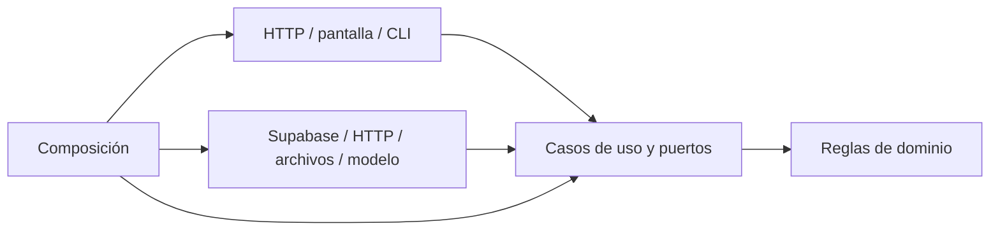

# Arquitectura hexagonal del proyecto

Estado de implementación: 2 de octubre de 2026.

La arquitectura se organiza por módulos con núcleos independientes de los
transportes y servicios que usan. Una pantalla, un servidor HTTP o un comando
CLI invoca casos de uso; estos aplican reglas de dominio y solicitan operaciones
mediante puertos. La composición proporciona las implementaciones concretas.

```text
backend/
  domain/                     Estados, identificadores y umbrales
  application/ports/in/        Contrato administrativo
  application/ports/out/       Identidad, repositorio y resultados
  application/use-cases/       Administración
  adapters/in/                HTTP Request/Response
  adapters/out/               Supabase, memoria y evaluación publicada
  bootstrap.mjs               Composición por solicitud
  server.mjs, edge.mjs         Entradas Node y Supabase Edge

frontend/
  src/domain/                 Cuenta, reportes, riesgo, históricos y simulación
  src/application/ports/      Contratos del navegador y servicios externos
  src/application/use-cases/  Sesión, preferencias, consultas, riesgo y simulación
  src/adapters/in/            Navegación y errores de presentación
  src/adapters/out/           SDK, HTTP, almacenamiento, reloj y datos demo
  src/bootstrap/              Composición para navegador
  shared/js/, web/js/, mobile/js/
                              Controladores DOM y bundles generados

dataset/
  domain/                     Muestreo estratificado y transformación
  application/                PrepareDataset y contratos de fuente/escritura
  adapters/                   CSV por HTTP; archivos CSV, JSON y SQL
  bootstrap.py                Composición de preparación

territorial/
  domain/                     Geometría, meteorología, etiquetas y particiones
  application/                Preparar, etiquetar y entrenar mediante puertos
  adapters/                   HTTP, archivos, reloj y scikit-learn
  bootstrap.py                Composición de herramientas
  pipeline.py, labels.py, training.py
                              Entradas CLI compatibles
```

## Dirección de dependencias



Las flechas representan dependencias de código. En ejecución los casos de uso
invocan los puertos inyectados. El dominio no importa adaptadores ni aplicación;
la aplicación no importa implementaciones de infraestructura. Los núcleos
territoriales usan pandas, NumPy y Shapely para cálculo en memoria; no realizan
HTTP ni lectura/escritura de archivos. scikit-learn está en el adaptador de
entrenamiento, sustituible mediante `ExperimentModel`.

## Operaciones y límites

- API: autorización, lecturas, operaciones, cambios de estado, configuración y
  evaluación histórica. `MemoryRepository` permite ejecutarla sin Supabase.
- Navegador: `BrowserService` coordina acceso administrativo, recuperación,
  contraseña, perfil, preferencias, consultas y reportes. `createRiskService`
  gestiona umbrales y actividad; `SimulationService` genera escenarios y
  mantiene historial mediante almacenamiento y entropía inyectados.
- Dataset: `PrepareDataset.execute()` lee mediante `DatasetSource`, calcula
  una muestra reproducible y entrega el resultado a `DatasetWriter`. El
  dominio no conoce URL, rutas, SQL ni formatos de salida.
- Territorial: preparación con `GeographySource`, `ResearchFiles` y `Clock`;
  etiquetado mediante `ResearchInput`; entrenamiento mediante
  `ExperimentModel`. Los experimentos continúan marcados como no operativos.

La sesión y el rol del navegador sirven para coordinar la interfaz. La
autorización efectiva permanece en la API y en las políticas RLS de Supabase.
Los reportes, preferencias y solicitudes comunitarias usan un adaptador SDK
con la sesión del usuario. Eso no obliga a pasarlos por una API administrativa
que no autoriza pobladores. Las pantallas no reciben el cliente SDK ni construyen
consultas de persistencia.

`colab/` conserva notebooks y herramientas experimentales independientes;
`scripts/` también contiene compilación, documentación y despliegue. Esos
artefactos no forman parte del núcleo de negocio ni son importados por él.
`supabase/` mantiene migraciones, restricciones, políticas y funciones nativas.

## Compilación y compatibilidad

`npm run build` genera `frontend/shared/js/backend.js` y `data.js` desde
`frontend/src/bootstrap/`, además del bundle del SDK. Editar las fuentes, no
los bundles. Los controladores DOM restantes son adaptadores de entrada.

Se conservan `/web/`, `/shared/`, `/mobile/`, `npm run dataset` y los comandos
territoriales existentes. El servidor local no publica `frontend/src/`, los
núcleos Python, credenciales ni SQL. Hosting publica los recursos compilados
del panel; la interfaz móvil permanece local.

## Comprobaciones reproducibles

```powershell
npm run build
npm test
python -m pip install -r territorial/requirements.txt
npm run test:python
python -m pip install playwright
# Windows: usa Microsoft Edge instalado. Linux: instalar Chromium de Playwright.
npm run test:browser
npm run build:api
```

`frontend-hexagonal.test.mjs` recorre el grafo de **todos** los módulos JS de
dominio y aplicación, verifica imports permitidos y prohíbe acceso al SDK,
HTTP y almacenamiento desde las pantallas. Prueba autenticación, fallos,
preferencias, reportes, simulación, riesgo y contratos de adaptadores.

`python_architecture_test.py` comprueba imports e I/O de los núcleos de dataset
y territorio. Las pruebas de dataset ejecutan fuentes en memoria, comprueban
muestreo, trazabilidad y preservación de los 300 registros. Las territoriales
conservan comprobaciones de cobertura, etiquetas y particiones temporales.

`browser_hexagonal.py` ejecuta los recursos compilados en un navegador real
contra un servidor local, con sustitutos de Supabase y respuestas HTTP. No
envía correos ni modifica servicios externos. Las pruebas `--live` son una
verificación adicional separada y no se ejecutan en este recorrido.
