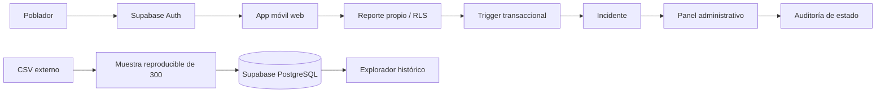

# Revisión técnica — 23 de septiembre de 2026

## Resultado

El proyecto pasó de un prototipo con datos locales a una aplicación web con interfaz móvil, Supabase Auth, persistencia PostgreSQL y separación por usuario. **Sigue siendo un prototipo funcional; no es todavía un sistema operativo de detección de incendios ni una aplicación Android/iOS instalada.**

## Hallazgos corregidos

| Hallazgo original | Cambio y evidencia |
| --- | --- |
| Entrar directamente al panel creaba una sesión administrativa | Se exige una sesión validada por Supabase y pertenencia a `administradores`; el rol de `sessionStorage` ya no autoriza accesos cloud. |
| Reportes e incidentes solo existían en `localStorage` | Tablas persistentes con RLS y lectura entre dispositivos autenticados. Demo local permanece separada. |
| Todos los reportes del dispositivo aparecían como propios | Cada reporte tiene `user_id`; otro cliente no puede leerlo ni insertarlo a nombre de un tercero. |
| Texto del reporte se interpolaba en HTML | Escape al renderizar reportes, alertas e incidentes; prueba de carga HTML maliciosa en ambas interfaces. |
| Envío de reporte y creación de incidente eran escrituras independientes | Trigger transaccional: un incidente por reporte; no se duplica desde frontend. |
| Se indicaba éxito antes de comprobar persistencia | Operaciones asíncronas con errores visibles y botones bloqueados durante el envío. El formulario se conserva si la API rechaza la escritura. |
| Una edición concurrente podía sobrescribir estados del panel | Actualización condicionada al estado anterior y error si cambió. Auditoría de transiciones. |
| La telemetría aleatoria se presentaba como actual | Etiqueta explícita de demo. Cloud no genera sensores ni enlace LoRa ficticio. |
| El CSV no coincidía con las variables del modelo actual | Explorador histórico separado, unidades originales y etiqueta binaria. Sin inventar viento, coordenadas o porcentaje de humo. |
| Primeras 300 filas sin variación de etiqueta | Muestra estratificada proporcional con semilla y hash de fuente. |
| Servidor estático podía exponer `.env` | Servidor con lista de rutas públicas; `.env`, SQL y credenciales locales devuelven 404. |
| «Planificar visita» solo mostraba un éxito falso | Ahora informa que la función no está implementada. |
| Números de apoyo sin validación documentada | Llamadas deshabilitadas hasta validar directorio; solicitud a operador sí persiste. |
| Documentación afirmaba «producción lista» | Avisos de documentación histórica y esta evaluación como referencia vigente. |

## Comprobaciones realizadas

- `npm test`: ejecuta las migraciones en PostgreSQL embebido (PGlite), prueba RLS con dos clientes/administrador/anónimo, rechaza privilegios indebidos, verifica triggers, auditoría, restricciones y 300 filas tras repetir el seed.
- `python tests/e2e_cloud.py --live`: prueba contra el proyecto Supabase real con cuentas temporales. Comprueba login móvil/admin, lectura de 300 filas, reporte, separación entre clientes, rechazo de escalada, protección ante HTML inyectado, transición administrativa, preferencias tras recargar, solicitud de apoyo y protección de archivos locales. Elimina las cuentas de prueba al terminar.
- Importación remota repetida: 300 filas, 214 con alarma, sin duplicados.
- `npm audit --omit=dev`: sin vulnerabilidades reportadas en las dependencias instaladas en la fecha de revisión.
- Revisión con asesores de Supabase: `request_help` usa `SECURITY DEFINER` de forma intencional y restringida. Protección contra contraseñas filtradas pendiente de habilitación/disponibilidad del plan. No se contrataron servicios de pago.

Estas pruebas no equivalen a una auditoría de seguridad completa, pruebas de carga ni validación de detección forestal. El envío/recepción de correo de confirmación y recuperación no se verificó en un buzón externo.

## Qué falta, en orden

### 1. Antes de pruebas con pobladores

- Alojar la web bajo HTTPS; configurar dominio y redirecciones de Auth.
- SMTP y entrega real de confirmación/recuperación; protección contra abuso de registro.
- Revisar privacidad, retención y eliminación de reportes/contactos; acordar quién puede ser administrador.
- Validar directorio telefónico y protocolo de respuesta. Registrar un incidente no confirma despacho de ayuda.
- Completar actualización/paginación del historial: la consulta actual toma los 200 registros más recientes y el panel muestra un resumen. «Sincronizar» consulta Supabase; no existe suscripción Realtime automática.
- Completar controles de cierre/falso positivo/asignación en la UI. El esquema los admite, pero el botón actual solo avanza Nuevo → En revisión → Validado.
- Endurecer la operación administrativa: MFA en la interfaz, política de recuperación y protección de contraseñas filtradas.

### 2. Para detectar incendios de verdad

- Inventario de dispositivos y lecturas con identificador, coordenadas, fecha de captura, unidad, calibración y calidad.
- Gateway LoRa con conectividad a internet y una API/Edge Function de ingestión autenticada; un navegador no recibe LoRa directamente.
- Modelo compatible con los sensores utilizados. El modelo Colab existente usa datos sintéticos y no fue entrenado con Smoke Detection IoT.
- Evaluación separada por tiempo/sesión, métricas de falsos positivos/negativos y validación en campo. Un CSV etiquetado no demuestra detección forestal en Satipo.
- Alertas deduplicadas con umbrales temporales, confirmación humana y pruebas de degradación cuando faltan datos.
- Mapa geográfico real y ubicación obtenida con consentimiento.

### 3. Para operar con conectividad rural

- PWA: manifiesto, service worker y cola local de envíos con reintentos e idempotencia. Ahora el modo cloud necesita internet.
- Push y sonido: hoy se guardan preferencias, pero no se envían notificaciones.
- Monitoreo, backups/restauración, presupuesto y límites de Supabase, pruebas de carga y plan de incidentes.
- Módulo real de mantenimiento de dispositivos y seguimiento de visitas.

## Flujo vigente

