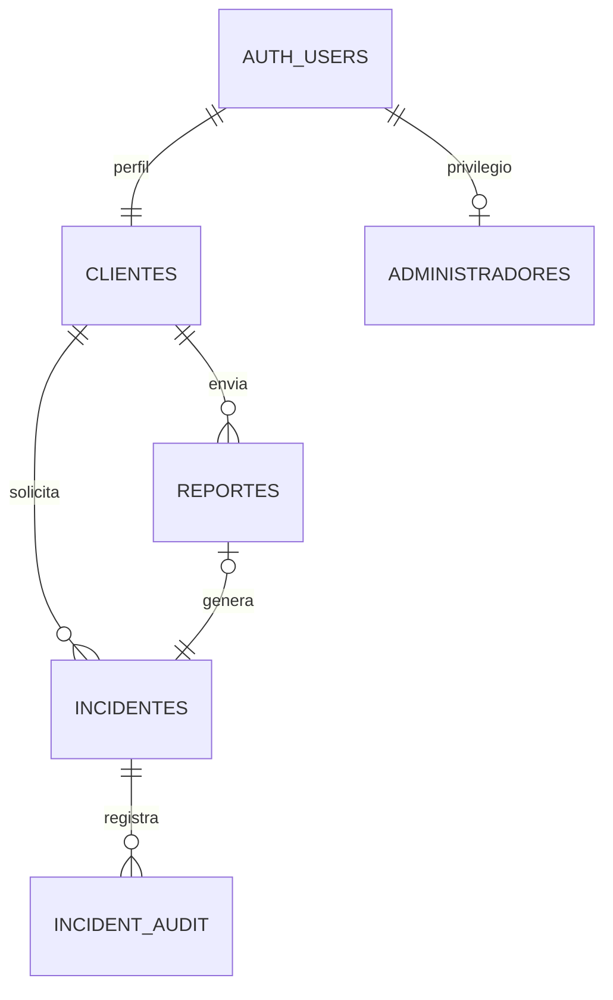

# Supabase — instalación y operación

## Proyecto creado

- Nombre: `alerta-satipo`.
- Referencia: `ddfmooylklgwnrmlxqzc`.
- Organización: `76778920-tech's Org`.
- [Abrir el proyecto](https://supabase.com/dashboard/project/ddfmooylklgwnrmlxqzc).
- La muestra importada tiene **300 registros: 86 sin alarma y 214 con alarma**.
- Tu configuración local está en `.env`; el navegador recibe únicamente URL y clave pública mediante `config/public.json`.
- La cuenta administrativa inicial usa `76778920@continental.edu.pe`. Su contraseña inicial está en **`config/admin.local.json`**, un archivo local ignorado por Git. Entra y cámbiala desde **Mi cuenta**. No se envió correo ni se publicó la contraseña.

## Modelo de datos

Cada poblador tiene una cuenta de Supabase Auth y una fila en `clientes`. No se crean tablas con el nombre de cada persona. La separación se aplica en PostgreSQL mediante RLS, aunque el usuario altere el JavaScript o haga peticiones directamente a la API.



| Tabla | Función y permisos |
| --- | --- |
| `auth.users` | Identidad y credenciales gestionadas por Supabase Auth. No se guardan contraseñas en las tablas del aplicativo. |
| `clientes` | Una fila por cuenta. Cada persona lee su perfil y actualiza sus preferencias; administradores pueden consultar perfiles. |
| `administradores` | Privilegio asignado solo desde una conexión administrativa. El registro público nunca crea administradores. Un administrador conserva también su perfil de cliente. |
| `smoke_readings` | Muestra histórica común, consultable tras autenticarse. Solo el proceso administrativo puede importar/modificar el dataset. |
| `reportes` | Cada cliente inserta y lee los suyos. Administradores leen todos. Sin edición/eliminación desde el navegador. |
| `incidentes` | Un trigger crea un incidente por reporte, dentro de la misma transacción. El cliente lee los suyos; el administrador cambia estado o responsable. |
| `incident_audit` | Historial de cambios de estado con usuario, fecha, estado anterior y nuevo. Lectura administrativa. |
| `app_settings` | Umbrales compartidos. Lectura autenticada; escritura solo administrativa. No transforman la etiqueta `Fire Alarm`. |

`private.is_admin()` comprueba la tabla administrativa y tiene un `search_path` fijo. No se expone como RPC público. `request_help()` es una RPC deliberadamente accesible a usuarios autenticados: exige al menos dos condiciones y utiliza `auth.uid()` del solicitante. No acepta un propietario enviado por el navegador.

## Ejecutar en esta computadora

```powershell
npm ci
npm run build
npm run configure
npm start
```

Abre `http://127.0.0.1:8000/shared/login.html`. Con el `.env` preparado se usa Supabase. No uses `python -m http.server` desde la raíz: publicaría también archivos privados. `scripts/serve.py` permite solo archivos del frontend y la configuración pública.

## Clonar en otra computadora

1. Copia `.env.example` a `.env`.
2. Usa `SATIPO_MODE=supabase`, la URL del proyecto y una clave `publishable` o `anon` del panel de Supabase.
3. Ejecuta `npm ci`, `npm run build`, `npm run configure` y `npm start`.
4. La clave administrativa **no es necesaria para ejecutar la aplicación**. Solo sirve para importación/provisión y nunca debe entrar a `config/public.json`.

`SATIPO_MODE=demo` habilita explícitamente el modo local y sus usuarios de demostración. No hay retorno automático a demo si falla Supabase.

## Migraciones e importación

Ya están aplicadas en el proyecto creado. Para otro proyecto nuevo:

```powershell
npx supabase login
npx supabase link --project-ref TU_REFERENCIA
npx supabase db push --include-seed
```

También puedes ejecutar en orden los archivos de `supabase/migrations/` desde el SQL Editor y luego `supabase/seed.sql`. No ejecutes ambos métodos para la misma migración sin sincronizar el historial.

La importación alternativa por API usa `SUPABASE_SECRET_KEY` solamente en el entorno local:

```powershell
npm run import:dataset
```

Verifica 300 registros y evita duplicados por `(dataset_id, source_row)`. Otra opción es importar `data/smoke_detection_300.csv` desde Table Editor después de crear el esquema; evita importar de nuevo el mismo CSV sin manejar la clave única.

## Cuentas nuevas

- **Pobladores:** «Crear cuenta de poblador» en el acceso; Supabase envía la confirmación según su configuración. El trigger crea `clientes` automáticamente y no confía en roles enviados en metadata.
- **Administradores adicionales:** primero crea/confirma la cuenta en Auth. Luego, desde SQL Editor con autorización administrativa:

```sql
insert into public.administradores(id, display_name)
values ('UUID_DE_AUTH_USERS', 'Nombre del operador');
```

La provisión inicial automatizada existe en `scripts/bootstrap-admin.mjs`. Requiere `ADMIN_EMAIL` y clave administrativa; no sobrescribe una cuenta existente. Genera una contraseña aleatoria local.

## Publicación posterior

GitHub almacena el código; no implica que el sitio esté alojado. Para alojarlo, publica únicamente frontend, datos de muestra y `config/public.json`. Nunca subas `.env`, `config/*.local.*`, SQL privado futuro ni credenciales administrativas. Configura un dominio HTTPS y agrégalo a Site URL / Redirect URLs en Supabase Auth. Hoy los enlaces autorizados son locales en el puerto 8000.

Antes de registros masivos, configura SMTP propio y prueba entrega y recuperación: el correo predeterminado de Supabase tiene límites. La interfaz incluye registro, recuperación y cambio de contraseña; esta entrega no verificó la recepción de correos en un buzón externo.

Referencias: [RLS](https://supabase.com/docs/guides/database/postgres/row-level-security), [perfiles asociados a Auth](https://supabase.com/docs/guides/auth/managing-user-data), [claves públicas y secretas](https://supabase.com/docs/guides/getting-started/api-keys), [importación](https://supabase.com/docs/guides/database/import-data).
